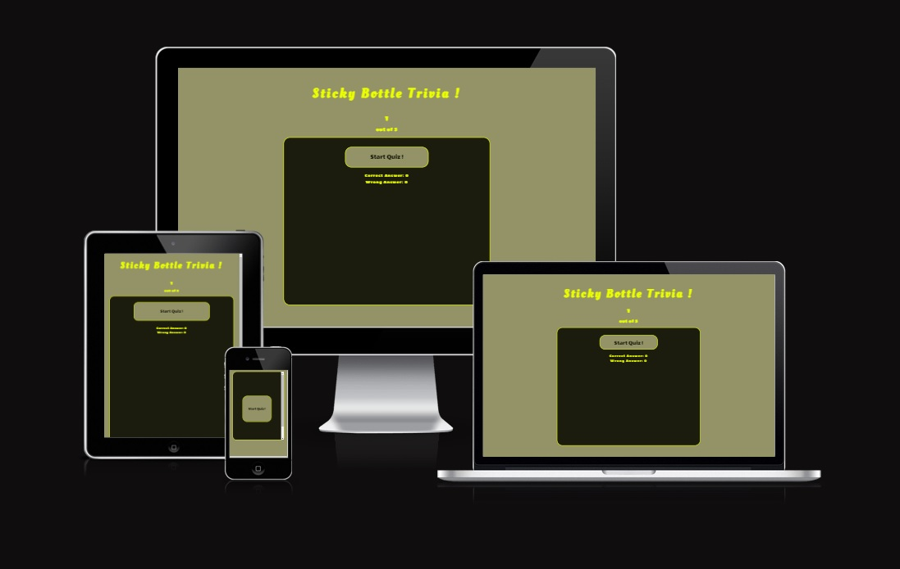
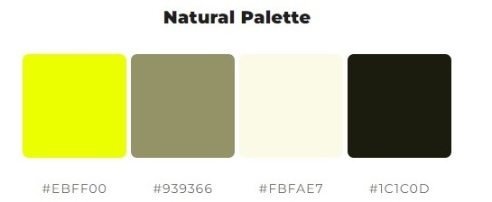

# Sticky Bottle Trivia !

## Quiz Purpose

Sticky Bottle Trivia provides the user a quiz with various questions relating to cycling. The quiz provides
a user friendly experience that can be played quickly, and a number of times if the user is that
way inclined. The quiz is designed to operate on any device available.

The purpose of the quiz is to present the user with 5 questions relating to cycling, allowing them
to test their knowledge, learn new information and enjoy the experience.

The quiz has been designed as a deliverable for the second project in the Code Institutes Diploma
in Full Stack Software Development.

Technologies used - HTML5, CSS3 and Javascript.

Link to live website as followed - [StickyBottleTrivia](https://john33mcd.github.io/projectTwo/ "link to Sticky bottle Trivia")

## User Stories

### New User

- I want to learn something new about a topic I am interested in or I know little about
- I want a quick and easy method of learning new knowledge
- I want a fun method of learning
- I want to do the whole quiz getting every answer correct

### Returning User

- I want to test what I remember from the last time I played the quiz
- I want to improve my score from my previous time playing the quiz
- I want to re-learn or revise previously obtained knowledge from the quiz

## Goal

Answer all questions correctly in one round of playing and retain new knowledge.

## Features

### Start Quiz

### Quiz Question

### Restart Quiz

## Design

### Colours

Palette was selected using [ColorSpace](https://mycolor.space/?hex=%23EBFF00&sub=1 "ColorSpace website")

## Testing

### Accessibility

- I have confirmed that colours and fonts used for the website are easy to read and accessible by running it through lighthouse in devtools

ADD LIGHTHOUSE IMAGE HERE

## Bugs

## Deployment

- The site has been deployed using Github pages, in order to do this I went to the settings page of my projects repository, went to the pages tab on the left hand side of the screen, selected the Main branch and saved - this then provides a link for my website as followed - 

## Authors

https://github.com/john33mcd

## Feedback

If you have any feedback, please reach out to me at jmcd-34@hotmail.com

# Credits

- Used Web Dev Simplified code from tutorial in order to implement javascript functionality for this quiz - [Web Dev Simplified](https://www.youtube.com/watch?v=riDzcEQbX6k "Web Dev simplified link for quiz tutorial")

- Used Brian Design code tutorial to learn and understand code - [Brian Designs](https://www.youtube.com/watch?v=f4fB9Xg2JEY&t=2921s "Brian Design tutorial video for quiz")

- 