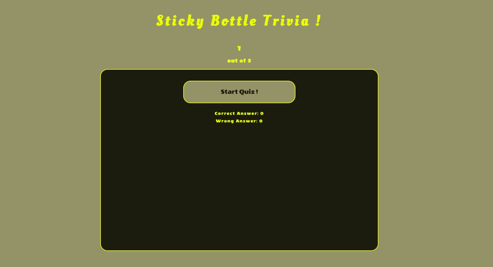
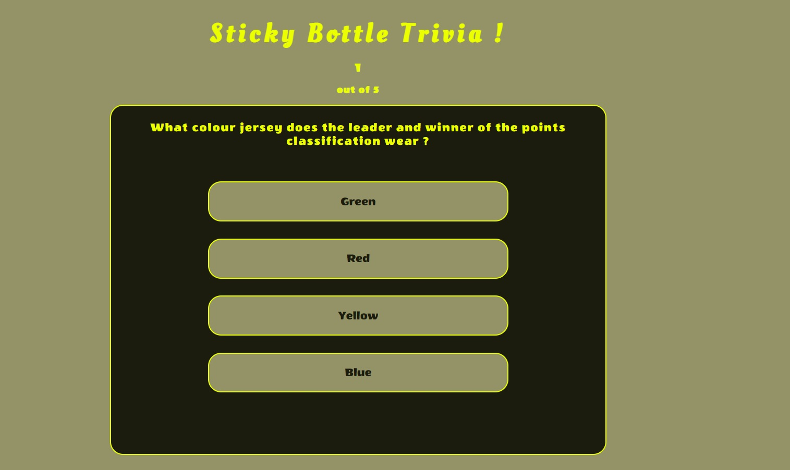
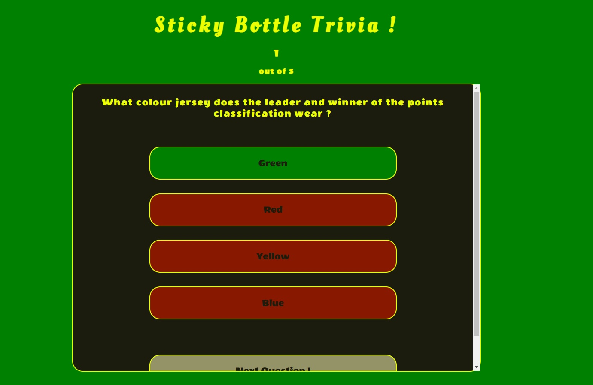
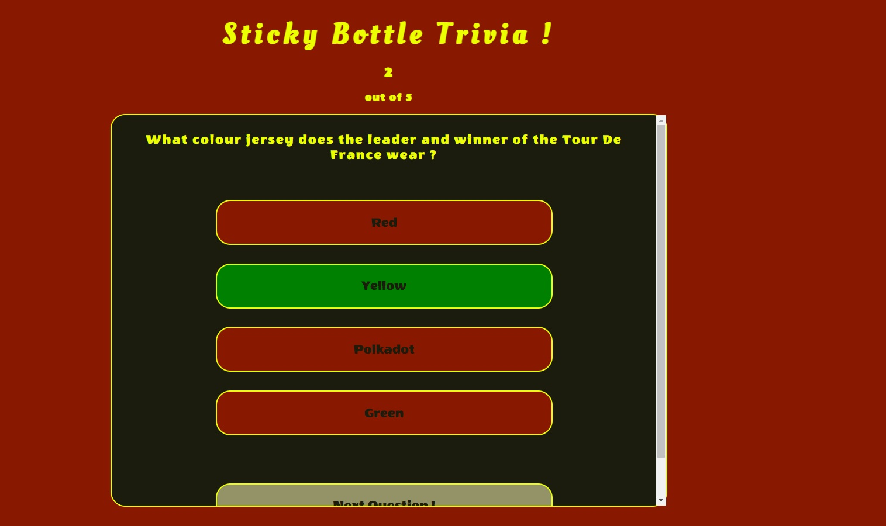
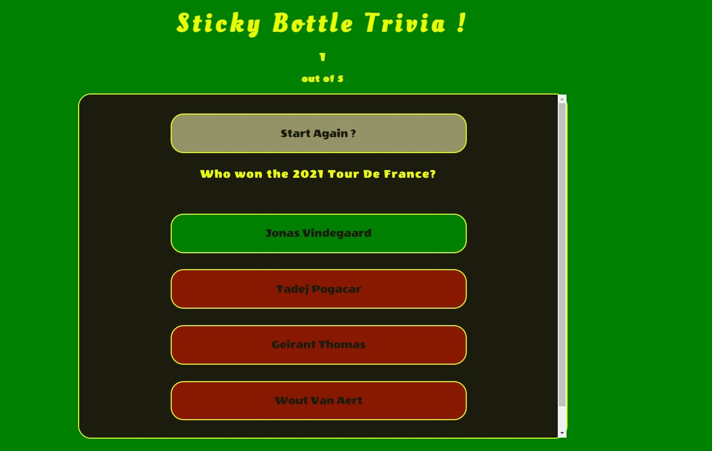
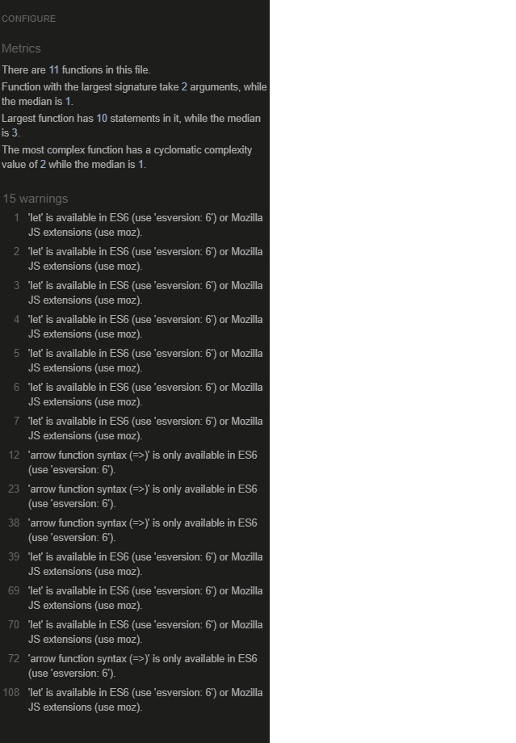
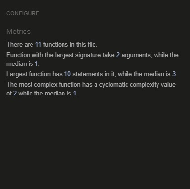
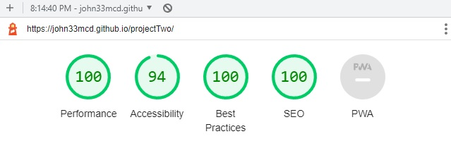

# Sticky Bottle Trivia !

## Quiz Purpose

Sticky Bottle Trivia provides the user a quiz with various questions relating to cycling. The quiz provides
a user friendly experience that can be played quickly, and a number of times if the user is that
way inclined. The quiz is designed to operate on any device available.

The purpose of the quiz is to present the user with 5 questions relating to cycling, allowing them
to test their knowledge, learn new information and enjoy the experience.

The quiz has been designed as a deliverable for the second project in the Code Institutes Diploma
in Full Stack Software Development.

Technologies used - HTML5, CSS3 and Javascript.

Link to live website as followed - [StickyBottleTrivia](https://john33mcd.github.io/projectTwo/ "link to Sticky bottle Trivia")

## User Stories

### New User

- I want to learn something new about a topic I am interested in or I know little about
- I want a quick and easy method of learning new knowledge
- I want a fun method of learning
- I want to do the whole quiz getting every answer correct

### Returning User

- I want to test what I remember from the last time I played the quiz
- I want to improve my score from my previous time playing the quiz
- I want to re-learn or revise previously obtained knowledge from the quiz

## Goal

Answer all questions correctly in one round of playing and retain new knowledge.

## Features

- Start Page

- Initial Question

- Correct Answer

- Incorrect Answer

- Last Page

### Start Quiz

The initial page is simple, displays the name of the quiz alongside the option of starting the quiz. There is a score counter
which is currenty being excluded, endeavour to build on this project and include it in future versions.

### Quiz Question

Once the user has clicked to start the quiz, they are presented with the first question from a preset selection of questions,
the questions are randomized, once the customer selects their answer they will be visually advised if they have successfully
selected the correct answer and will be provided a button to move to the next question.

### Correct Answer

If the user successfully picks the correct answer, both the button with the correct answer and the background will turn green. The options which are
incorrect will turn red. Once a selection is picked, the option to move to the next question is provided.

### Incorrect Answer

If the user picks the wrong answer, the background will turn red, as will the three wrong options. The option which is
correct will turn green. Once a selection is picked, the option to move to the next question is provided.

### Restart Quiz

When all questions have been answered, the start button appears with new text allowing the user to restart the quiz.

## Design

### Colours

Palette was selected using [ColorSpace](https://mycolor.space/?hex=%23EBFF00&sub=1 "ColorSpace website")

## Testing

## Validation

warnings relating to use of let identified with JSHint -

 Using new Javascript features (ES6) is added to configuration there are no warnings apparent.

 

### Accessibility

- Lighthouse test conducted, result below

## Bugs

- bug 1 - bug where the linear gradient background was not covering the page, the feature was not used in the 
final version of the project however I fixed this issue by using the background-attachment
css code, learned this from stack overflow at the following - https://stackoverflow.com/questions/16841323/making-gradient-background-fill-page-with-css 

- bug 2 - buttons were leaving the game area at smaller resolutions - learned about overflow auto function which adds
scroll bar - https://stackoverflow.com/questions/11219931/how-to-force-div-element-to-keep-its-contents-inside-container

- bug3 - was using background-image and a gradient to make gradient effects on buttons and elements, this was effecting functionality, I reverted to solid colours in order to simplify the project and move forward.

- bug4 - used text overflow in order to add drop down for each button, this was not ideal aesthetically but was implemented to continue working on the project.

- bug5 - fixed bug wherein score counter was disappearing due to font change for buttons, targeted font directly via ID for correct score.

- bug6 - question was disappearing when correct answer was selected, bug fixed by removing css that was targeting correct class element and turning
font black (which matched background).

## Deployment

- The site has been deployed using Github pages, in order to do this I went to the settings page of my projects repository, went to the pages tab on the left hand side of the screen, selected the Main branch and saved - this then provides a link for my website as followed - [StickyBottleTrivia](https://john33mcd.github.io/projectTwo/ "link to Sticky bottle Trivia")

## Authors

https://github.com/john33mcd

## Feedback

If you have any feedback, please reach out to me at jmcd-34@hotmail.com

# Credits

- Used Web Dev Simplified code from tutorial in order to implement javascript functionality for this quiz - [Web Dev Simplified](https://www.youtube.com/watch?v=riDzcEQbX6k "Web Dev simplified link for quiz tutorial")

- Used Brian Design code tutorial to learn and understand code - [Brian Designs](https://www.youtube.com/watch?v=f4fB9Xg2JEY&t=2921s "Brian Design tutorial video for quiz")

- Used [W3Schools](https://www.w3schools.com/ "W3Schools") regularly to address a multitude of different coding challenges and issues that arose throughout project

- Used [Stackoverflow](https://www.stackoverflow.com/ "W3Schools") regularly to address a multitude of different coding challenges and issues that arose throughout project